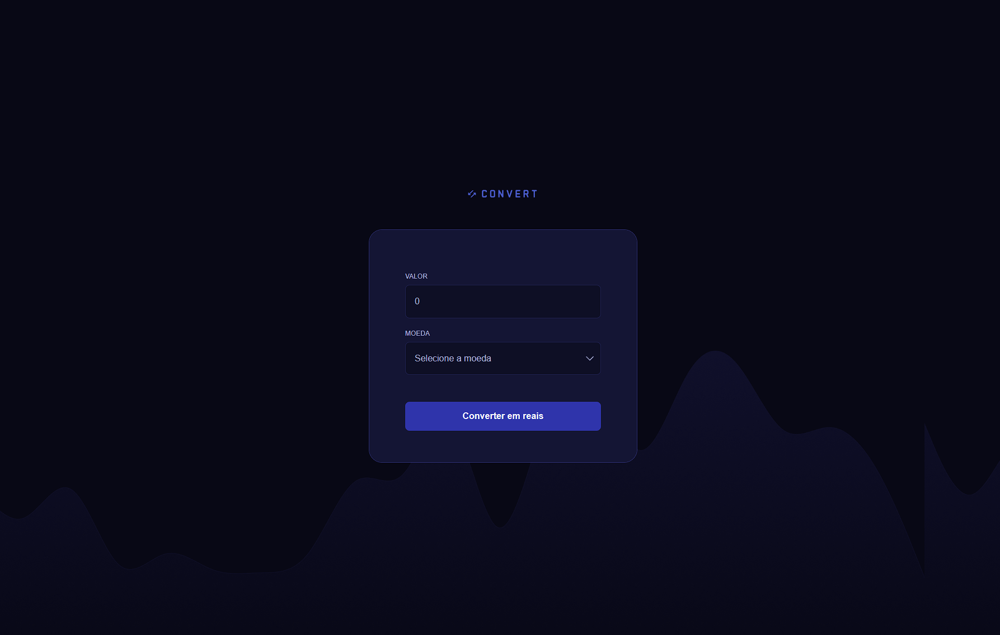

# Convert

Conversor de moedas (Dólar, Euro e Libra) para Real, feito em HTML, CSS e JavaScript.

Demo: https://theusan777.github.io/convert-template/

## Preview

<p align="center">
  
</p>

## Sobre o projeto

O usuário digita um valor, escolhe a moeda (Dólar Americano, Euro ou Libra Esterlina) e recebe o valor convertido em reais. As taxas de câmbio são fixas no código, não vêm de uma API externa.

## Tecnologias

- HTML
- CSS
- JavaScript

## Funcionalidades

- Conversão de USD, EUR e GBP para BRL
- Campo de valor aceita só números (filtro no input)
- Formatação do resultado em moeda brasileira usando `Intl.NumberFormat`
- Mensagem de erro caso a conversão falhe

## Estrutura do projeto

```
index.html
script.js
styles.css
img/
  logo.svg
  check.svg
  chevron-down.svg
  bg.png
```

## Como executar

git clone https://github.com/theusan777/convert-template.git

Depois é só abrir o `index.html` no navegador.

## Deploy

[Acessar projeto](https://theusan777.github.io/convert-template/)

## Aprendizados

Pratiquei manipulação de formulário sem reload de página (`preventDefault`), validação de input em tempo real e formatação de moeda com a API `Intl` do JavaScript.

## Próximos passos

- Buscar as taxas de câmbio em uma API em vez de valores fixos no código
